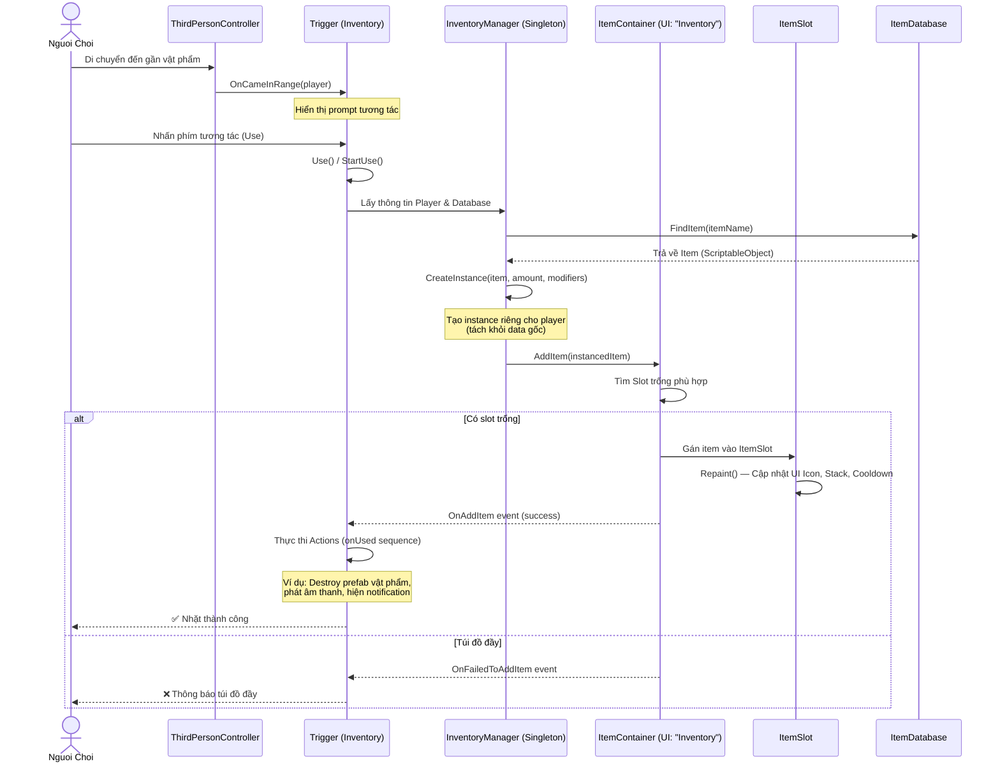
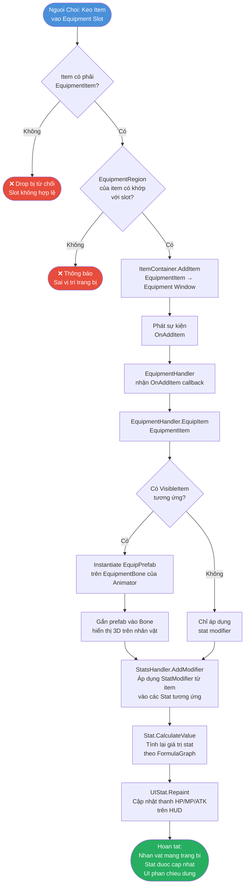

# Báo Cáo Phân Tích Hệ Thống: DevionGames Unity RPG Framework

---

## 1. Phân Tích Tổng Quan Hệ Thống

### Mục Đích Chính

Đây là một **Unity RPG Framework** mã nguồn mở được phát triển bởi **Devion Games**, cung cấp bộ công cụ hoàn chỉnh để xây dựng các tựa game nhập vai (RPG) / hành động trên nền tảng Unity. Framework bao gồm toàn bộ vòng đời gameplay cốt lõi: quản lý nhân vật, hệ thống trang bị, chỉ số (stats), chế tạo đồ (crafting), mua bán (vendor), UI tương tác, điều khiển nhân vật và hệ thống sự kiện/trigger.

---

### Các Thành Phần Cốt Lõi (Core Modules)

| Module | Namespace | Vai Trò |
|---|---|---|
| **Inventory System** | `DevionGames.InventorySystem` | Quản lý vật phẩm, túi đồ, trang bị, chế tạo, mua bán |
| **Stat System** | `DevionGames.StatSystem` | Quản lý chỉ số nhân vật (HP, MP, ATK...), modifier, effect |
| **UI Widgets** | `DevionGames.UIWidgets` | Bộ UI component tái sử dụng: widget, slot, tooltip, dialog, notification |
| **Graphs** | `DevionGames.Graphs` | Hệ thống graph/formula dạng node để tính toán giá trị động (ví dụ: công thức stat) |
| **Triggers** | `DevionGames` | Hệ thống trigger, sequence action cho logic sự kiện trong game |
| **Third Person Controller** | `DevionGames` | Điều khiển nhân vật góc nhìn thứ 3, camera, chuyển động (Motion State Machine) |
| **Utilities** | `DevionGames` | Các tiện ích dùng chung: `Blackboard`, `CallbackHandler`, JSON serialize, tween, attribute |
| **Module Manager** | `DevionGames` | Quản lý việc tích hợp và khởi tạo các plugin/module |

---

### Đánh Giá Kiến Trúc & Design Pattern

- **Singleton Pattern**: `InventoryManager.current`, `StatsManager` — đảm bảo điểm truy cập toàn cục duy nhất cho từng hệ thống quản lý.
- **ScriptableObject Data Pattern**: `Item`, `Stat`, `StatEffect`, `Formula`, `Category` đều là `ScriptableObject` — tách biệt rõ ràng giữa *dữ liệu* (data assets) và *logic* (MonoBehaviour), dễ cấu hình trong Unity Editor.
- **Observer / Event System Pattern**: `CallbackHandler`, `UnityEvent`, delegate (`OnAddItem`, `OnRemoveItem`...) được dùng rộng rãi để tách biệt các thành phần và phản ứng với sự kiện.
- **Template Method Pattern**: `Action`, `FlowNode`, `MotionState` là các abstract base class — subclass chỉ cần override phương thức hành vi cụ thể (`OnUpdate`, `Execute`...).
- **Component / Entity-Component Pattern**: Dựa trên kiến trúc `MonoBehaviour` của Unity, mỗi hệ thống được gắn như một component lên GameObject.
- **Strategy Pattern**: `ItemModifier`, `StatModifier`, `Action` — cho phép hoán đổi hành vi động tại runtime mà không thay đổi lớp chứa.
- **Chain of Responsibility**: Hệ thống `Trigger → BehaviorTrigger → BaseTrigger` cho phép chuỗi xử lý sự kiện đi qua nhiều handler.
- **Node Graph / Visual Scripting**: Module `Graphs` xây dựng một mini visual scripting engine dạng data-flow, được dùng chủ yếu để tính toán công thức stat.

---

## 2. Biểu Đồ Quan Hệ Lớp (Class Diagram)

Biểu đồ dưới đây thể hiện các thực thể cốt lõi và mối quan hệ giữa chúng trong toàn bộ framework:

```mermaid
classDiagram
    direction TB

    %% ─── Utilities Layer ───
    class CallbackHandler {
        <<abstract MonoBehaviour>>
        +List~Entry~ delegates
        +Execute(eventID, eventData)
        +RegisterListener(eventID, call)
    }

    class Blackboard {
        <<MonoBehaviour>>
        -List~Variable~ m_Variables
        +GetValue~T~(name) T
        +SetValue~T~(name, value)
        +AddVariable(name, value, type)
    }

    class Variable {
        <<abstract>>
        +string name
        +bool isShared
        +RawValue : object
    }

    Blackboard "1" o-- "many" Variable : contains

    %% ─── Graph Layer ───
    class Graph {
        <<Serializable>>
        +List~Node~ nodes
        +FindNodesOfType~T~() List
    }

    class Node {
        <<abstract>>
        +string id
        +string name
        +Graph graph
    }

    class FlowGraph {
        +List~Edge~ edges
        +List~Port~ ports
    }

    class FlowNode {
        <<abstract>>
        +List~Port~ Inputs
        +List~Port~ Outputs
        +GetValue() float
    }

    class FormulaGraph {
    }

    class Formula {
        <<ScriptableObject>>
        -FormulaGraph m_Graph
    }

    Graph "1" *-- "many" Node : contains
    FlowGraph --|> Graph
    FlowNode --|> Node
    FormulaGraph --|> FlowGraph
    Formula "1" *-- "1" FormulaGraph : owns

    %% ─── Stat System ───
    class Stat {
        <<ScriptableObject>>
        +string Name
        +float BaseValue
        +float Value
        -FormulaGraph m_FormulaGraph
        +Initialize(handler, override)
        +AddModifier(modifier)
        +CalculateValue()
    }

    class Attribute {
    }

    class Level {
    }

    class StatModifier {
        +float value
        +StatModifierType type
        +Apply(baseValue) float
    }

    class StatEffect {
        <<ScriptableObject>>
        +string Name
        +List~StatModifier~ modifiers
        +Initialize(handler)
    }

    class StatsHandler {
        <<MonoBehaviour>>
        +List~Stat~ m_Stats
        +List~StatEffect~ m_Effects
        +GetStat(name) Stat
        +AddModifier(stat, modifier)
    }

    class StatsManager {
        <<MonoBehaviour Singleton>>
        +RegisterStatsHandler(handler)
        +GetStatsHandler(name) StatsHandler
    }

    Attribute --|> Stat
    Level --|> Stat
    Stat "1" o-- "many" StatModifier : modified by
    Stat "1" *-- "1" FormulaGraph : computed by
    StatsHandler "1" *-- "many" Stat : manages
    StatsHandler "1" o-- "many" StatEffect : applies
    StatsManager "1" --> "many" StatsHandler : registry

    %% ─── Item Hierarchy ───
    class Item {
        <<ScriptableObject>>
        +string Id
        +string Name
        +Sprite Icon
        +int Stack
        +int MaxStack
        +float BuyPrice
        +Rarity Rarity
        +List~Ingredient~ ingredients
        +bool IsCraftable
    }

    class UsableItem {
        +List~ItemAction~ actions
        +float Cooldown
        +Use(itemContainer)
    }

    class EquipmentItem {
        +List~EquipmentRegion~ Region
        +GameObject EquipPrefab
    }

    class Currency {
        +CurrencyConversion conversion
    }

    class Skill {
        +float CastTime
        +float Range
    }

    UsableItem --|> Item
    EquipmentItem --|> UsableItem
    Currency --|> Item
    Skill --|> UsableItem

    %% ─── Item Runtime Management ───
    class ItemCollection {
        <<MonoBehaviour>>
        +List~Item~ m_Items
        +List~int~ m_Amounts
        +UnityEvent onChange
        +Initialize()
    }

    class InventoryManager {
        <<MonoBehaviour Singleton>>
        +ItemDatabase Database
        +PlayerInfo PlayerInfo
        +CreateInstances(items, amounts) List
        +Save() / Load()
    }

    class ItemDatabase {
        <<ScriptableObject>>
        +List~Item~ items
        +List~Category~ categories
        +List~EquipmentRegion~ equipmentRegions
        +Find~T~(name) T
    }

    class Category {
        <<ScriptableObject>>
        +string Name
    }

    class EquipmentRegion {
        <<ScriptableObject>>
        +string Name
    }

    InventoryManager "1" *-- "1" ItemDatabase : references
    ItemDatabase "1" *-- "many" Item : stores
    ItemDatabase "1" *-- "many" Category : stores
    ItemDatabase "1" *-- "many" EquipmentRegion : stores
    ItemCollection "1" *-- "many" Item : contains
    Item "1" --> "1" Category : belongs to

    %% ─── UI Layer ───
    class UIWidget {
        <<CallbackHandler>>
        +string WindowName
        +Show() / Hide()
        +bool IsVisible
    }

    class UIContainer~T~ {
        <<abstract UIWidget>>
        +List~UISlot~ slots
        +AddSlot() / RemoveSlot()
    }

    class ItemContainer {
        <<UIWidget>>
        +event OnAddItem
        +event OnRemoveItem
        +event OnUseItem
        +event OnDropItem
        +AddItem(item) bool
        +RemoveItem(item, amount) bool
        +GetItem(name) Item
    }

    class Slot {
        <<CallbackHandler>>
        +Item observedItem
        +Repaint()
    }

    class ItemSlot {
        +KeyCode UseKey
        +ItemContainer Ingredients
        +Image CooldownOverlay
    }

    UIWidget --|> CallbackHandler
    UIContainer~T~ --|> UIWidget
    ItemContainer --|> UIWidget
    ItemSlot --|> Slot
    Slot --|> CallbackHandler
    ItemContainer "1" *-- "many" ItemSlot : contains

    %% ─── Equipment Handler ───
    class EquipmentHandler {
        <<MonoBehaviour>>
        +List~EquipmentBone~ Bones
        +List~VisibleItem~ VisibleItems
        +EquipItem(item)
        +UnEquipItem(item)
    }

    EquipmentHandler "1" --> "1" ItemContainer : listens to
    EquipmentHandler "1" --> "many" EquipmentItem : equips

    %% ─── Trigger / Action System ───
    class BaseTrigger {
        <<abstract CallbackHandler>>
        +Use()
        +bool InUse
        +float Range
    }

    class BehaviorTrigger {
        <<BaseTrigger>>
        +Actions onUsed
        +Actions onUnused
        +PlayerInfo PlayerInfo
    }

    class InventoryTrigger["Trigger (Inventory)"] {
        <<BehaviorTrigger>>
        +FailureCause enum
        +ItemContainer currentUsedWindow
    }

    class VendorTrigger {
        +float BuyPriceFactor
        +float SellPriceFactor
        +BuyItem(item) bool
        +SellItem(item) bool
    }

    class CraftingTrigger {
        +string RequiredIngredientsWindow
        +CraftItem(item)
    }

    class Actions {
        +List~Action~ actions
    }

    class Action {
        <<abstract>>
        +OnUpdate() ActionStatus
        +OnStart()
        +OnEnd()
    }

    BaseTrigger --|> CallbackHandler
    BehaviorTrigger --|> BaseTrigger
    InventoryTrigger --|> BehaviorTrigger
    VendorTrigger --|> InventoryTrigger
    CraftingTrigger --|> InventoryTrigger
    BehaviorTrigger "1" *-- "2" Actions : onUsed/onUnused
    Actions "1" *-- "many" Action : sequence

    %% ─── Controller ───
    class ThirdPersonController {
        <<MonoBehaviour>>
        +float SpeedMultiplier
        +AimType AimType
        +List~MotionState~ motions
    }

    class MotionState {
        <<abstract>>
        +CanEnterState() bool
        +OnEnterState()
        +OnUpdateState()
        +OnExitState()
    }

    ThirdPersonController "1" *-- "many" MotionState : manages
```

> **Giải thích biểu đồ:**
> - **Utilities Layer** (màu xám): `CallbackHandler` và `Blackboard` là nền tảng dùng chung cho toàn framework.
> - **Graph Layer**: `Formula → FormulaGraph → FlowNode` tạo thành một mini visual scripting engine, được nhúng vào `Stat` để tính giá trị động.
> - **Stat System**: `Stat` (ScriptableObject data) được quản lý bởi `StatsHandler` (MonoBehaviour) trên mỗi nhân vật. `StatsManager` là registry toàn cục.
> - **Item Hierarchy**: `Item → UsableItem → EquipmentItem` thể hiện rõ quan hệ kế thừa theo chức năng ngày càng phức tạp.
> - **UI Layer**: `ItemContainer` (túi đồ UI) chứa nhiều `ItemSlot`, kế thừa từ `UIWidget`. Đây là cầu nối giữa data và giao diện.
> - **Trigger/Action System**: Pattern Chain — `BaseTrigger → BehaviorTrigger → InventoryTrigger → VendorTrigger/CraftingTrigger`, với `Actions` là danh sách các `Action` chạy theo sequence.

---

## 3. Biểu Đồ Luồng Hệ Thống (System Flow Diagrams)

### 3.1 Luồng Nhặt Vật Phẩm & Thêm Vào Túi Đồ (Item Pickup Flow)

Đây là luồng nghiệp vụ phổ biến nhất, xảy ra khi người chơi nhặt một vật phẩm trong thế giới game:

> **Giải thích luồng:**
> - `ThirdPersonController` phát hiện vật phẩm trong range và thông báo qua `Trigger`.
> - `InventoryManager` đóng vai trò **Facade** — tạo ra instance mới từ ScriptableObject data gốc (`ItemDatabase`), đảm bảo mỗi item trong inventory là một bản sao độc lập (có thể có modifier, stack khác nhau).
> - `ItemContainer` xử lý logic nghiệp vụ (tìm slot, kiểm tra điều kiện), `ItemSlot` chỉ đảm nhiệm hiển thị UI.
> - Toàn bộ kết quả (success/fail) được thông báo ngược lại qua **event system** (`UnityEvent`/delegates), giữ cho các thành phần **loosely coupled**.

---

### 3.2 Luồng Trang Bị Vật Phẩm (Equipment Flow)

Luồng này xảy ra khi người chơi kéo-thả hoặc double-click một `EquipmentItem` từ túi đồ sang ô trang bị:

> **Giải thích luồng:**
> - **Validation layer**: Hệ thống kiểm tra 2 cấp độ — kiểu item (`EquipmentItem`) và vùng trang bị (`EquipmentRegion`), từ chối drop nếu không khớp.
> - **`EquipmentHandler`** là component trung gian lắng nghe `OnAddItem` từ `ItemContainer`, sau đó điều phối việc gắn prefab 3D lên skeleton của nhân vật.
> - **Stat propagation**: Sau khi trang bị, `StatModifier` từ item được đẩy vào `StatsHandler → Stat → CalculateValue()`. Hàm này duyệt qua `FormulaGraph` (hệ thống node graph) để cho ra giá trị cuối cùng.
> - **Reactive UI**: `UIStat` MonoBehaviour đăng ký lắng nghe `onValueChange` event của `Stat`, tự động cập nhật thanh chỉ số trên HUD mà không cần polling.

---

*Tài liệu được tạo tự động bằng phân tích tĩnh mã nguồn Unity C# của repository `Nukial/TEST`. Các biểu đồ sử dụng cú pháp **Mermaid.js** và có thể render trực tiếp trên GitHub, GitLab, Notion, Obsidian và các trình đọc Markdown tương thích.*
